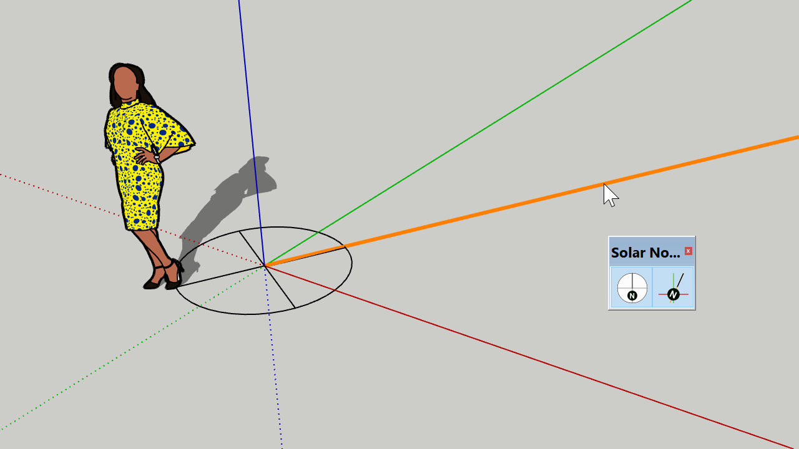

# Solar North

Display and set the solar north angle used for shadows. Useful for shadow studies.

## UX Example

This extension also serves as a code example for SktchUp-like UX design, e.g.:

* Showing toolbar button/menu entry as checked when a tool is active,
* Handling toolbar button/menu entry icons for different systems and SketchUp versions,
* Handling locale decimal sign - comma vs full stop,
* Drawing the compass in 3D space - this can be used to convey depth and perspective for custom handles, and
* Drawing the compass at the same screen size regardless of zoom level.
